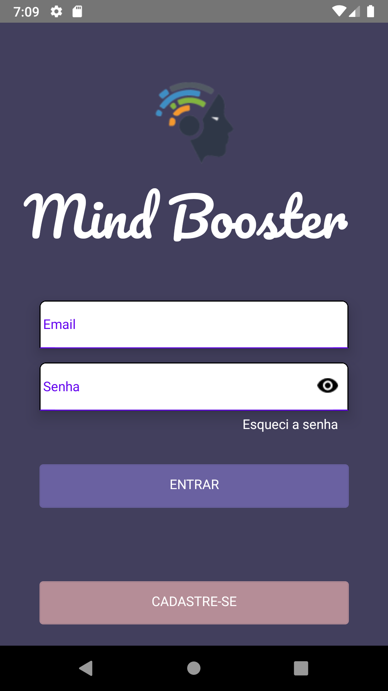
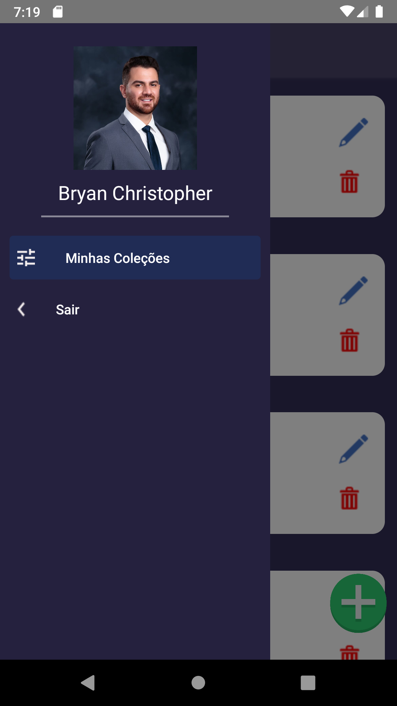

# Screenshots

 

# Descrição do Projeto

<text> O projeto ainda não está completo, ele se resume a um sistema de flashcards com frente e verso, muito utilizado para memorizar outros idiomas e palavras.
Além disso, existe algumas funcionalidades não implementada, como: Filtro de busca de decks e flashcards, Funcionalidade de colocar uma imagem da sua galeria
como perfil e no ícone do baralho e do flashcard.</text>

<text> O aplicativo em sua essência está entregando o principal, além das funcionalidades do cadastro, login, CRUD dos baralhos e flashcards, e o embaralhamento de 
flashcards para jogar.</text>

# Como rodar

1. Tenha um emulador android
2. utilizando o diretório da pasta no cmd dê "npm install"
3. utilize o comando "react-native run-android" para rodar o projeto em seu emulador.
